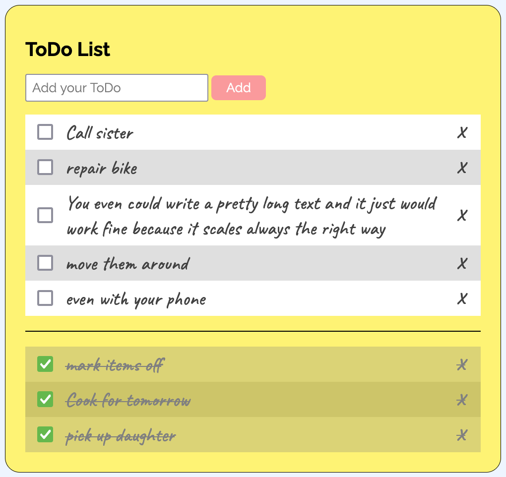

# ToDo list

A little, fully responsive ToDo list.

<a href="https://hannesdonel.github.io/ToDo-List/">Use the app.</a>

## Technologies

- HTML
- CSS
- jQuery
- parcel
- eslint
- stylelint

## Functionality

- add new items
- remove items
- mark items as done
- move them around (touch support given)

## Get started

You can start a development server on `http://localhost:1234/` via `npm run dev`.
